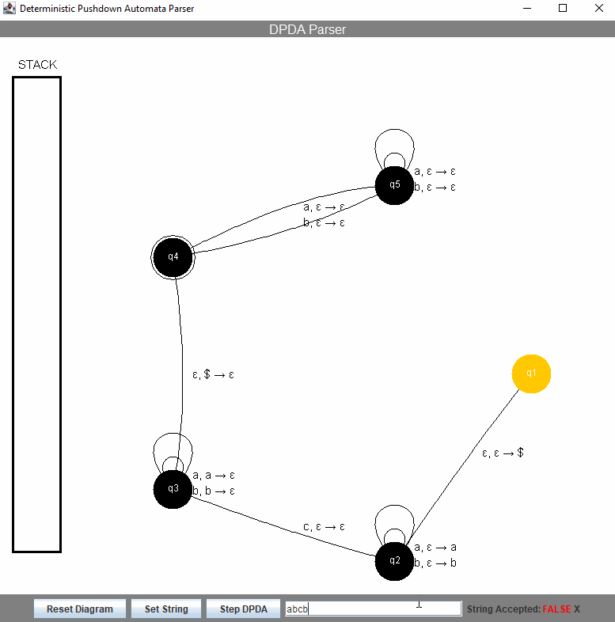

<h1 align="center">Deterministic Pushdown Automata GUI</h1>

  

        

This is a project I developed for my graduate Theory of Computation class at UNC Greensboro. Users can build a DPDA schema in a .txt file, load it into the program, and trace a string through as input.

## Dependencies
No dependencies are required.

## Rebuilding Deterministic Pushdown Automata GUI

This project was built using the NetBeans 8.2 IDE. However, any IDE will work. For IDEs that require projects (e.g. NetBeans, IntelliJ, Eclipse), create a project, then clone the repository to your src/ folder.

## Reporting Bugs

See the Issues Tab.

## Version History
The **master** branch encompasses all changes throughout development. Originally, the gui-branch contained the GUI version of this project (originally, it was text-only). However, I decided to merge the GUI program into **master** since it is the definitive version. This project is discontinued.
